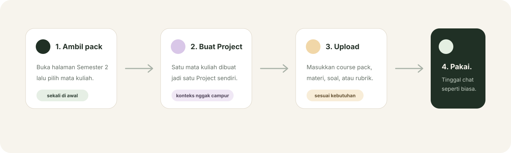

<p align="center">
  
  
</p>

<p align="center">
  <a href="https://man612.github.io/ramu/"><strong>Buka Ramu</strong></a>
  ·
  <a href="https://man612.github.io/ramu/setup.html">Mulai setup Semester 2</a>
  ·
  <a href="docs/RISET-DAN-DASAR-DESAIN.md">Dasar riset</a>
</p>

<p align="center">
  
  
  
  
</p>

---

## Ramu itu apa?

Ramu adalah **setelan siap pakai untuk ChatGPT Projects** supaya tiap mata kuliah punya ruang, konteks, sumber, dan cara pengecekan sendiri.

Jadi bukan aplikasi pengganti ChatGPT dan bukan tempat kumpulan jawaban tugas. Ramu cuma menyiapkan “meja belajar”-nya supaya kamu tidak perlu menjelaskan dari nol setiap kali membuka tugas baru.

<table>
<tr>
<td width="50%" valign="top">
<h3>Tanpa Ramu</h3>
<p>Kamu buka chat baru lalu harus menjelaskan lagi:</p>
<ul>
<li>ini mata kuliah apa;</li>
<li>materi yang sedang dipakai;</li>
<li>format tugas;</li>
<li>sumber mana yang harus dipercaya;</li>
<li>cara mengecek hitungan/jawaban.</li>
</ul>
</td>
<td width="50%" valign="top">
<h3>Dengan Ramu</h3>
<p>Kamu buka Project mata kuliahnya lalu cukup kirim:</p>
<p><code>aku nggak paham bagian ini</code></p>
<p><code>cek jawaban aku</code></p>
<p><code>bantu kerjain soal ini pelan-pelan</code></p>
<p><code>ini feedback tutor kemarin</code></p>
</td>
</tr>
</table>

## Cara pakainya

<p align="center">
  
</p>

Untuk paket pertama, Ramu sudah menyiapkan **UT · S1 Akuntansi · Semester 2 · 2026/2027**. Kamu cukup membuat lima Project di ChatGPT:

| Project | Mata kuliah | SKS |
|---|---|---:|
| `S2 • Perpajakan` | EACC4104 Perpajakan | 3 |
| `S2 • AKM I` | EACC4103 Akuntansi Keuangan Menengah I | 3 |
| `S2 • Manajemen Keuangan` | EMBS4210 Manajemen Keuangan | 3 |
| `S2 • Ekonomi Mikro` | ECON4102 Pengantar Ekonomi Mikro | 3 |
| `S2 • Manajemen` | EMBS4101 Manajemen | 4 |

> **Kalau cuma mau pakai:** buka [panduan setup interaktif](https://man612.github.io/ramu/setup.html). Tidak perlu memahami struktur repo ini.

## Fondasi Ramu

<table>
<tr>
<td align="center" width="20%"><h3>R</h3><b>Referensi</b><br><sub>sumber yang tepat untuk pertanyaan yang tepat</sub></td>
<td align="center" width="20%"><h3>I</h3><b>Instruksi</b><br><sub>aturan kampus, tutor, rubrik, dan tugas tidak dicampur</sub></td>
<td align="center" width="20%"><h3>Z</h3><b>Zona Konteks</b><br><sub>satu mata kuliah tetap berada di ruangnya sendiri</sub></td>
<td align="center" width="20%"><h3>M</h3><b>Materi</b><br><sub>BMP dan bahan kelas tetap jadi dasar belajar</sub></td>
<td align="center" width="20%"><h3>A</h3><b>Asesmen</b><br><sub>jawaban dicek lagi sebelum dianggap selesai</sub></td>
</tr>
</table>

Lima fondasi ini bukan lima fitur terpisah yang harus kamu atur manual. Semuanya sudah diterjemahkan ke Project Instructions dan course pack.

## Yang sudah disiapkan

- **Project Instructions** — aturan umum yang dipakai di semua Project.
- **Course pack per mata kuliah** — konteks, sumber, workflow, dan verifier yang spesifik.
- **Panduan Android** — langkah setup dari aplikasi ChatGPT.
- **Aturan sumber & freshness** — terutama untuk informasi yang bisa berubah seperti perpajakan.
- **Eval** — skenario uji untuk mengecek perilaku pack, bukan cuma membaca prompt-nya.
- **GitHub Pages** — tampilan yang lebih gampang dipakai kalau tidak terbiasa dengan GitHub.

## Kenapa satu mata kuliah = satu Project?

Karena satu Project besar untuk seluruh semester cepat berubah menjadi campuran lima konteks, file, dan percakapan. Ramu sengaja memisahkannya supaya:

- file tiap mata kuliah tidak bercampur;
- chat lama lebih mudah dicari;
- instruksi satu mata kuliah tidak bocor ke mata kuliah lain;
- feedback tutor bisa disimpan di tempat yang tepat;
- penggunaan sehari-hari tetap sederhana.

Detail alasan dan dasar risetnya ada di [`docs/RISET-DAN-DASAR-DESAIN.md`](docs/RISET-DAN-DASAR-DESAIN.md).

## Struktur repo

```text
ramu/
├── core/       prinsip dasar Ramu
├── docs/       panduan, riset, dan validasi
├── evals/      skenario uji
├── packs/      paket kampus / prodi / semester
├── site/       GitHub Pages
└── .github/    workflow dan aset README
```

## Status paket UT Semester 2

**Sumber terverifikasi** berarti data utama paket sudah dicocokkan dengan sumber resmi yang masih berlaku, tetapi pack belum diberi label **Terverifikasi penuh** sampai eval perilakunya selesai dijalankan.

Acuan utama saat ini:

- Katalog Kurikulum UT 2026/2027 edisi Juli 2026.
- Pedoman Sistem Penyelenggaraan UT 2026/2027.

Ramu tidak menyertakan salinan BMP atau materi kuliah berhak cipta. Materi yang memang dimiliki mahasiswa dimasukkan sendiri ke Project saat diperlukan.

---

<p align="center">
  <b>Mulai dari sini → <a href="https://man612.github.io/ramu/setup.html">Setup UT S1 Akuntansi Semester 2</a></b>
</p>

<p align="center">
  <sub>Proyek independen. Bukan layanan resmi Universitas Terbuka maupun OpenAI.</sub>
</p>
